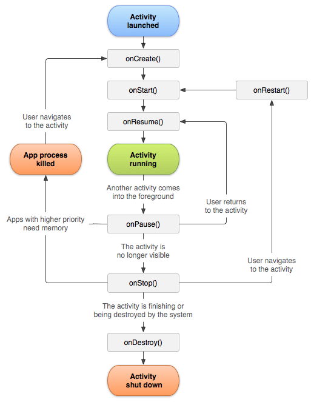

### Activity

- 화면에 표시되는 UI 구성을 위해 가장 기본이 되는 요소다.
- 어플리케이션은 여러 개의 Activity로 구성된다.
- Activity는 또 다른 Activity를 시작할 수 있다.
- 새로운 Activity가 시작되면 이전 Activitiy는 중단 되지만 `스택`에 보존하고 있다.
- LifeCycle 안드로이드 앱 참고

1. LifeCycle



- `전체 수명` : onCreate()와 onDestroy() 사이

  - onCreate에서 설정을 수행한 후에 나머지 리소스를 모두 onDestroy에서 해제해준다.

- `가시적 수명` : onStart()와 onStop() 사이

  - 사용자가 Activity와 상호작용 할 수 있는 시기다.

- `전경 수명` : onResume()과 onPause() 사이
  - 현재 Activity가 다른 Activity앞에 표시 되고, 사용자 입력도 집중된다.

2. Activity 상태 저장

- onSaveInstanceState()를 구현해 Activity상태에 관한 중요한 정보를 보존할 수 있다.
- Bundle로 저장된다.
- onCreate와 onRestoreInstanceState()에 전달된다.
- 이전 상태가 복구된다.

3. onCreate

- `Activity가 처음 생성되었을 때` 호출된다.
- `정적 설정을 모두 수행`해야 한다.
- `뒤에 항상 onStart()`가 호출된다.
- `setContentView(layout file)`를 이곳에서 호출해야 Activity의 사용자 인터페이스 레이아웃을 정의할 수 있다.

4. onStart

- Activity가 사용자에게 `화면을 보여줄 준비가 되었을 때` 호출된다.

5. onResume

- Activity가 시작되고 사용자와 `상호 작용하기 직전`에 호출된다.

6. Activity Running

- Activity가 사용자에게 화면을 보여줄 준비가 되었을 때 호출된다.
- `사용자가 Activity와 상호 작용이 가능`한 시기다.

7. onPause

- `화면이 일부 가려진 상태`
- 시스템이 다른 Activity를 재개하기 직전에 호출된다.
- 보통 데이터를 유지하기 위해서 `저장되지 않은 정보를 저장하는 용도로 사용`한다.
- 이 메소드가 반환이 될때까지 다음 Activity가 실행되지 않기 때문에 빠르게 종료시켜야 한다.
- `화면이 다시 보여지게 되면 onResume()`이 따라오고 `사라지게 되면 onStop()`이 따라온다.

8. onStop

- Activity가 `더 이상 사용자에게 보여지지 않는 상태`다.
- 사용자에게 다시 보여지게 되면 onRestart()가 따라오고 사라지게 되면 onDestroy()가 따라온다.

9. onDestroy

- `Activity가 소멸되기 직전`에 호출된다.
- Activity의 마지막 LifeCyle이다.
- 의도적으로 혹은 시스템 리소스를 절약하기 위해 종료 됐을수도 있다.

### Intent

- 어플리케이션 `구성 요소간에 작업 수행을 위한 정보 전달`을 하는 역할

- 종류

  - `명시적 Intent` : 작업을 수행하길 원하는 컴포넌트를 정확히 지목

  ```java
  // 현재 Activity에서 다음 Activity로 이동 (권장)
  Intent intent = new Intent(this, NextActivity);
  startActivity(intent);
  ```

  - `암시적 Intent` : 해당 작업을 할 수 있는 컴포넌트 전부에게 전달, Activity에서 사용하기 보단 공유버튼시 사용 ex) 인터넷 실행시 Chrome, Naver, Safari 등등..

  ```java
  Intent intent = new Intent(package.name.NextActivity);
  startActivity(intent);
  ```

- 사용 종류

  - WebView

  ```java
  Intent intent = new Intent(Intent.ACTION_VIEW, Uri.parse("http://naver.com"));
  startActivity(intent);
  ```

  - Call

  ```java
  Intent intent = new Intent(Intent.ACTION_CALL, Uri.parse("tel:01012341234"));
  startActivity(intent);
  ```

* Intent filter

  - 여러 Intent가 들어오는데 Intent filter를 통해 내가 원하는 Intent만 받아서 요청이 들어오는 작업을 진행
  - ex) 카카오앱은 카카오택시를 열수 있지만, 내가 만든 앱은 열 수 없다. 그 이유는 카카오택시가 Intent filter를 통해 카카오앱만 동작하게 막아놓기 때문이다.

* Intent data 전달

  - Intent에 data를 넣는 방법 (putExtra)

  ```java
  Intent intent = new Intent(this, NextActivity);
  Intent.putExtra(KEY, VALUE);
  ```

  - Intent에서 data를 꺼내는 방법 (getIntent)

  ```java
  Intent intent = getIntent();
  String data = intent.getString(KEY);
  ```

* Intent의 결과값 받기 : Intent로 새로 생성된 Activity로 부터 응답 받기

```java
// 상황 : Activity A에서 Activity B로 작업 요청하고 Activity A는 요청된 작업의 결과값을 받고 싶다.

// Activity A
Intent intent = new Intent(this, NextActivity);
startActivityForResult(intent, REQUEST_CODE);

// Activity B
Intent intent = new Intent();
intent.putExtra(KEY, VALUE);
setResult(RESULT_CODE, intent)

// Activity A
@Override
Protect void onActivityResult(int requestCode, int resultCode, Intent data){
    if(requestCode = REQUEST_CODE){
        String result = intent.getString(KEY)
    }
}
```

### Stack

1. 관리 방법

1) Launch Mode

- 속성

  - standard

    - 기본 모드다.
    - 다중 인스턴스를 허용한다.

  - singleTop

    - 조건부 다중 인스턴스 허용한다.
    - 해당 Activity가 최상위 stack에 있을 경우에는, `onNewIntent()메서드를 호출`한다.

  - singleTask

    - 비권장한다. (구글문서 명시)
    - 오직 한개만 생성될 수 있고, 자신이 새로운 stack을 만들어나가고, 다른 Activity들을 위에 쌓을 수 있다.

  - singleInstance

    - 비권장한다. (구글문서 명시)
    - 오직 한개만 생성될 수 있고, 자신이 새로운 stack을 만들어나가고, 다른 Activitiy들을 위에 쌓을 수 없다.

1. Intent Flag

- 종류

  - FLAG_ACTIVITY_BROUGHT_TO_FRONT

    - 시스템에 의해 설정되는 값
    - Activity가 singleTask이고 이미 Activity 스택에 존재하고 있는 상태라고 가정 했을 때, 호출된 Activity가 다시 호출된다.

  - FLAG_ACTIVITY_CLEAR_WHEN_TASK_RESET

    - 플래그가 사용된 Activity로부터 최상단의 Activity까지 모두 삭제한다.

  - FLAG_ACTIVITY_CLEAR_TOP

    - 스택에 Activity가 존재하고 있을 경우 새롭게 생성하지 않고, 앞으로 가져온다.
    - 앞으로 가져올 때 최상단 Activity로부터 호출된 Activity까지 모두 삭제한다.

  - FLAG_ACTIVITY_NO_ANIMATION

    - 액티비티가 전환 될때 애니메이션 효과를 사용하지 않는다.

  - FLAG_ACTIVITY_REORDER_TO_FRONT

    - 호출 하려는 Activity가 스택에 존재하고 있는 경우 스택의 순서를 재정렬한다.

### Thread

작업 흐름을 의미한다.

메인(UI) Thread

- Thread의 시작과 끝이 프로그램의 시작과 끝이 같은 쓰레드를 의미한다.
- 안드로이드의 경우는 메인 Thread에서만 UI를 구축할 수 있기 때문이다.
- 메인 Thread는 멈춰서는 안된다. (프로그램이 종료됨)

### Context

- 자신이 어떤 어플리케이션인지 알려주는 ID 역할을 한다.
- 안드로이드 시스템 서비스에 제공하는 기능을 호출하는 역할을 한다.

- 종류

  - Application Context
  - Activity Context
